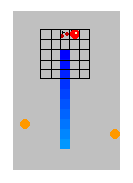
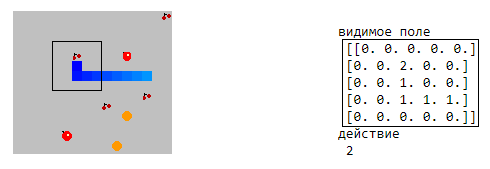
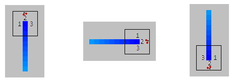

### Pensive Snake - задумчивая змейка
    
    Змейка под управлением Искусственного интеллекта (Artificial Intelligence), построенном на самом простом и медленном 
    алгоритме машинного обучения - k-ближайших соседа (KNN).
    
    Доступно два режима работы: 
1. Режим ручной разметки (AI = False). 
2. Режим управления AI. 

    Змейке можно разрешить или запретить рост по мере съедания фруктов в обоих режимах. Но только в режиме управления AI можно задать существование нескольких змеек одновременно. Также доступно самопереобучение змейки в случае её зацикливания.
    
    Алгоритм KNN со встроенным скользящем контролем, метриками качества и оценкой важности признаков, а также метод перебалансировки (Random sampling) и алгоритм генерации новых наблюдений (SMOTE) реализованы в этомблокноте с нуля на языке Python.

###  Описание идеи

Видимая змейкой область ограничена небольшим полем (змеи плохо видят). Размер поля задается параметром rang. По умолчанию его значение равно 2 - число клеток, видимых прямо, слева, сзади и справа змейки. Голова змейки темнее её хвоста.

Препятствия (тело змейки, край поля, капролит) помечаются на поле - 1, фрукт - 2, а пустые клетки - 0.

Пример данного поля будет сохранен в наблюдениях в следующем виде:
[[0. 0. 0. 0. 0. 0. 0. 2. 0. 0. 0. 0. 1. 0. 0. 0. 0. 1. 1. 1. 0. 0. 0. 0. 0.]]     [2]
наблюдение (объект)                                                                целевая переменная (ответ)

Направление движения (действия) кодируется так: 1 - двигаться влево; 2 - двигаться вправо; 3 - двигаться налево. Данные коды это классы для алгоритма KNN. Направление движения в режиме разметки задается пользователем, см. дальше.   

Порядок действий:
1. В режиме разметки перемещаем змейку стрелками, огибая препятствия, съедая фрукты. 
2. Считываем разметку. Смотрим на дисбаланс классов. Используя встроенный в алгоритм KNN скользящий контроль оцениваем качество работы алгоритма.
3. Запускаем змейку в режиме управления (AI = True).
4. После быстрой смерти змейки... 8( пробуем различные методы перебалансировки наблюдений по классам или генерации новых наблюдений. Далее повторяем п.3. 
